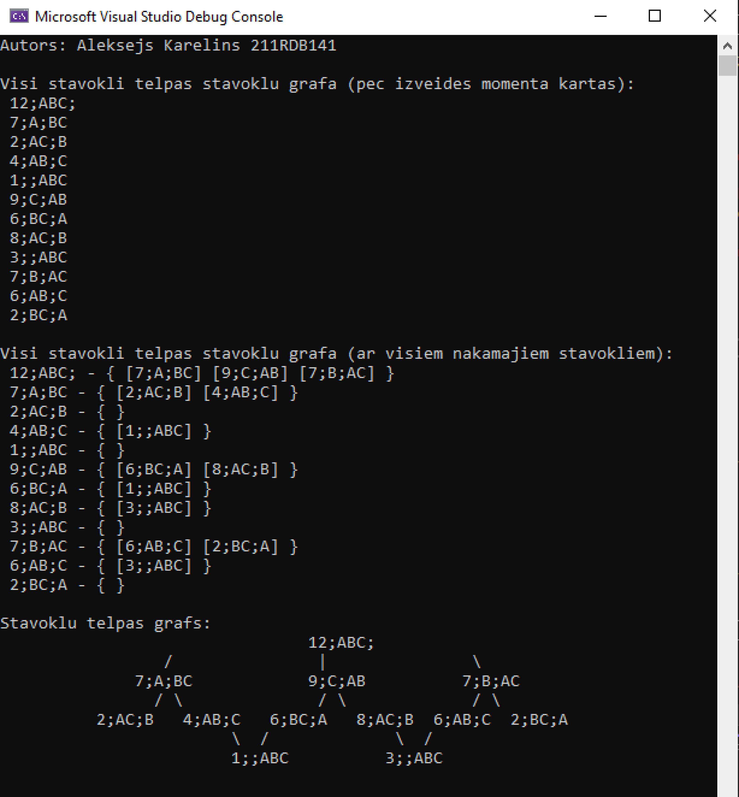
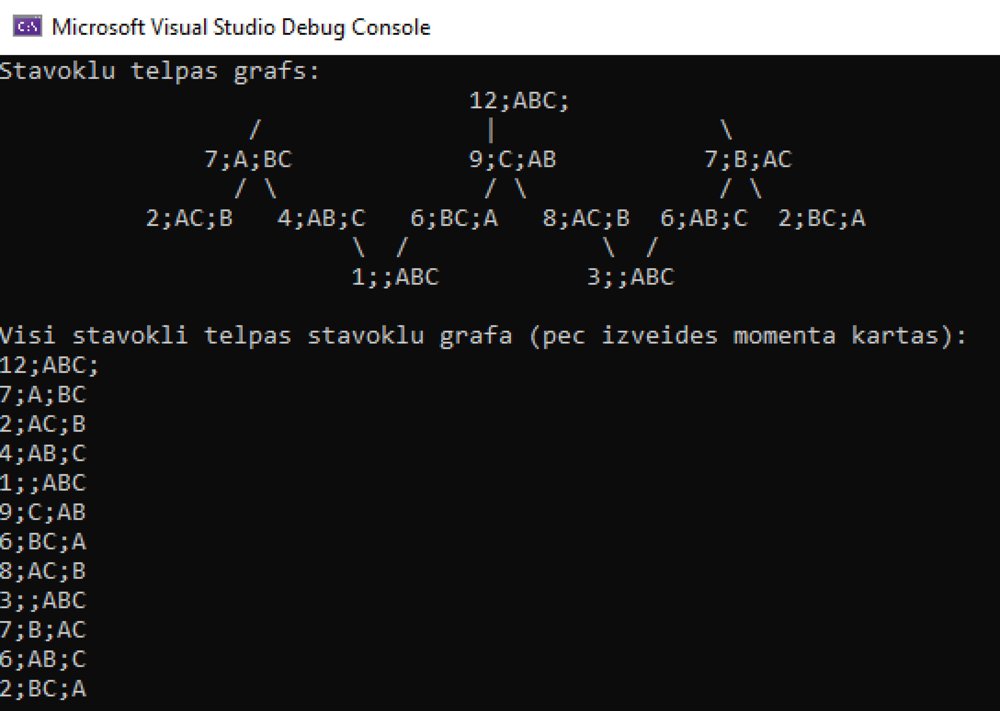

# Izaicinājums: datu struktūras kods
Repozitorijs izaicinājumam (termiņš - 1. marts).

## :warning: Svarīga informācija :warning:
24.februarī tika **veikti koda uzlabojumi**, lai būtu iespējams redzētu katru stāvokli (kādas ir nākamas un kādi stāvokļi ir saistīti).

Diemžēl šo progresu es nevaru iesniegt kā Word dokumentu (dokuments tika galīgi iesniegts), tāpēc, ***gribu palūgt*** apskatīt atzaru [24_02_ver], lai novērtētu manu darbu.

Iesniegtais progress Word dokumentā ir atradams [main] atzarā.

Sasniegts rezultāts atzarā [24_02_ver]:

Sasniegts rezultāts atzarā [main]:

[24_02_ver]: https://github.com/Wolferado/Artificial_Intelligence_Graph_Challenge/tree/24_02_ver
[main]: https://github.com/Wolferado/Artificial_Intelligence_Graph_Challenge
