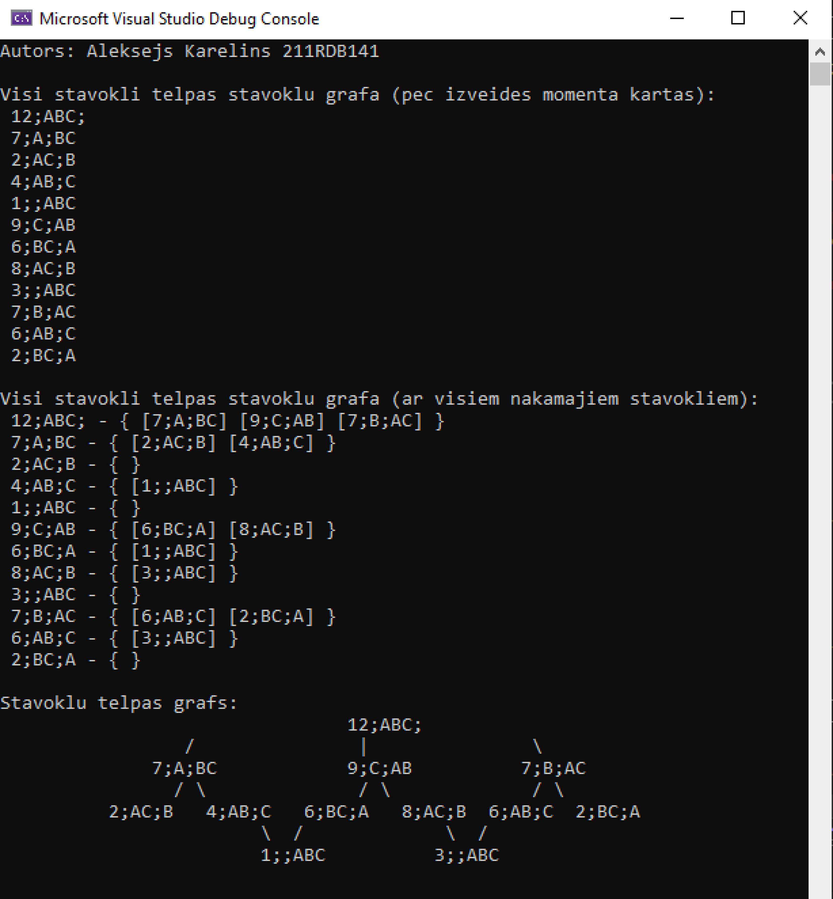

# Izaicinājums: datu struktūras kods

> [!WARNING]
> Repozitorijs tiks arhivēts, tāpēc kā:
> - Tas tika pārbaudīts un ieskaitīts.

> [!NOTE]
> Šis ir repozitorijs izaicinājumam (termiņš - 1. marts) RTU kursā "Mākslīga intelekta pamati".
>
> Tika iegūti 1.5 punkti no 2 maksimāliem. Cēlonis - Neskaidra rezultāta izvade.

### Sasniegts rezultāts:

